# Exercise 1: Microsoft Entra ID Governance (IGA)

**Estimated Duration: 90 minutes**

## Overview

In this exercise, you will explore how to implement core Identity Governance capabilities using Microsoft Entra ID. You will learn how to manage users and groups dynamically, automate onboarding and offboarding processes using lifecycle workflows, and enhance security through access reviews and conditional access policies. By the end of this exercise, you will gain hands-on experience in building a modern identity governance solution.

## Prerequisites

The following are prerequisites to complete this exercise which are already configured in this lab environment:

- An active Microsoft Entra ID tenant
- A user account with Global Administrator or Identity Governance Administrator role
- Microsoft Entra ID P2 / Governance /Entra suite license enabled  
- 2–3 test users available for validation

## Lab Objectives

In this lab, you will complete the following exercise:

- Task 1: Manage Users and Groups
- Task 2: Entra ID Lifecycle Management
- Task 3: Setting Up Access Reviews
- Task 4: Implementing Conditional Access Policies
- Task 5: Monitoring and Auditing with Entra ID (Optional)

## Task 1: Manage Users and Groups

In this task, you will create dynamic groups based on user attributes and define rules to automatically manage group membership and validate that memberships are updated dynamically based on the configured conditions.

1. Open a new tab in the browser and navigate to **Microsoft Entra admin center** using below link.

   ```
   https://entra.microsoft.com
   ```

1. If prompted, provide the credentials below:

   - **Email/Username:** <inject key="AzureUserEmail"></inject>

   - **Password:** <inject key="AzureUserPassword"></inject>

1. Take a moment to familiarize yourself with Microsoft Entra admin center.

   

1. In the left pane, expand **Entra ID (1)** and select **Groups (2)** then click on **New group (3)**.

   

1. On the **New Group** page, configure the following:

   - **Group type**: Security **(1)**
   - **Group name**: `IT-Department` **(2)**
   - **Group description**: `Dynamic group for IT Department members` **(3)**
   - **Membership type**: Dynamic User **(4)**

1. Under **Dynamic user members**, click **Add dynamic query (5)**.

   

1. In the **Dynamic membership rules** page, configure the following rules and click on **Save (5)**.

   - **Property**: `department` **(1)**
   - **Operator**: `Equals` **(2)**
   - **Value**: `IT`**(3)**

   In the Rule syntax, the rule expression should like below **(4)**:
   ```
   (user.department -eq "IT")
   ```
   

1. Click **Create**.

   

1. Click **+ New group** again to create another dynamic group.

   

1. On the **New Group** page, configure the following:
   - **Group type**: Security **(1)**
   - **Group name**: `Managers` **(2)**
   - **Group description**: `Dynamic group for all managers` **(3)**
   - **Membership type**: Dynamic User **(4)**

1. Under **Dynamic user members**, click **Add dynamic query (5)**.

   

1. In the **Dynamic membership rules** page, click on **Edit (1)** then configure the following rules **(2)** and click on **Save (3)**.
   ```
   (user.jobTitle -contains "Manager")
   ```
   

1. Click **Create**.

   

1. In the left pane, go to **Users**, click on **ADUser1** to open the profile.

   

1. Click **Edit properties**.

   

1. Select **Job Information (1)** and set the following attributes and then click on **Save (4)**

   - **Job title**: `IT Manager` **(2)**
   - **Department**: `IT` **(3)**

   

1. Navigate back to **Groups (1)**, select **All groups (2)** and Click on **IT-Department (3)**.

   

1. Select **Members**, verify that **ADUser1** now added to the group dynamically.

   
   >**Note:** If user is not appeared then wait a few minutes and then click Refresh.

1. Check for **Managers** group to confirm the `ADUser1` added as a member in the group.

   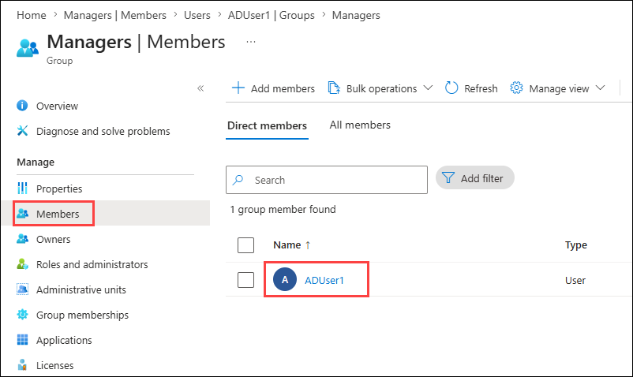

1. You can also validate the users by using **Validate rules**.

1. Click on **Dynamic membership rules (1)** and select **Validate rules (2)**.

1. Click on **+ Add user (3)**, select **ADUser2 (4)** and check the **validation (5)** details.

   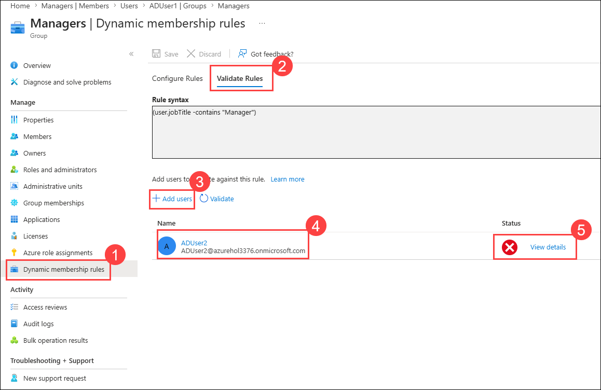

## Task 2: Entra ID Lifecycle Management

Microsoft Entra Lifecycle Workflows automate identity processes across the employee lifecycle from onboarding (joiner) to role changes (mover) to offboarding (leaver). This replaces manual HR-driven processes and reduces the risk of orphaned accounts.

### Task 2.1: Configure Onboarding Workflow

In this task, you will set up a lifecycle workflow to automate the onboarding process for new employees. You will configure triggers and automate tasks such as sending welcome emails, assigning licenses, and adding users to groups.

1. In the Microsoft Entra admin center, expand **ID Governance (1)** in the left navigation pane and select **Lifecycle workflows (2)**. Then click on **+ Create workflow (3)**

   

1. You will see the Lifecycle Workflows dashboard with template categories: **Joiner**, **Mover**, and **Leaver**. Select **Onboard new hire employee**.

   

1. On the **Basics** page, provide Name as **Onboard New Employee - IT Department (1)**. and then click **Next: Configure (2)**.

   

1. On the **Configure** page, Make the rule department value as **IT (1)** then click **Next: Review tasks (2)**.

   

1. On the **Review tasks** page, you will see pre-configured tasks. Click **+ Add task (1)** to add additional tasks.

1. Select **Generate TAP and send email (2)** and **Add license to User (3)** then click on **Add (4)**.

   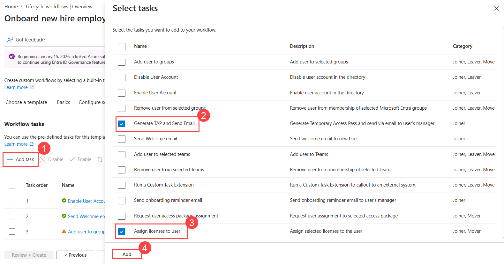

1. Click on **Add license to User (1)** then click on **0 license selected (2)**

   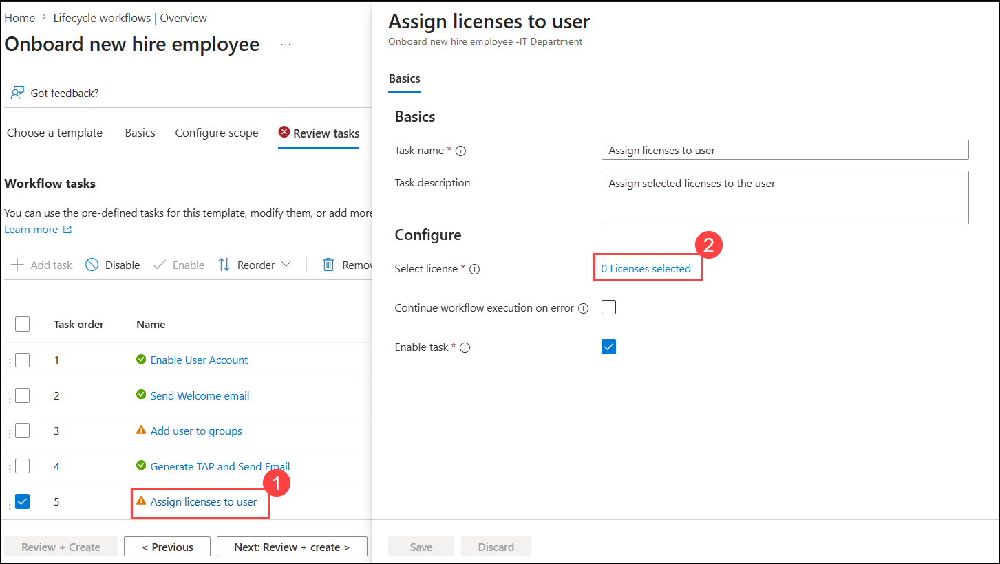

1. Select **Office 365 E1 (1)** then clcik on **select (2)**.

   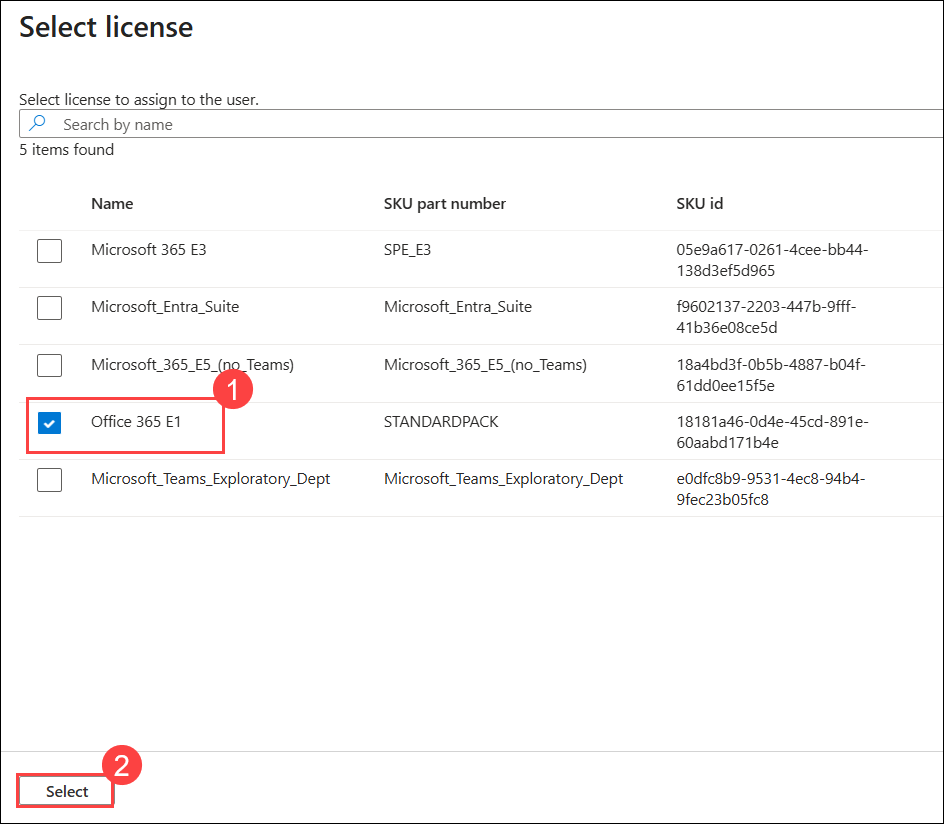

1. Click on **Save**.

   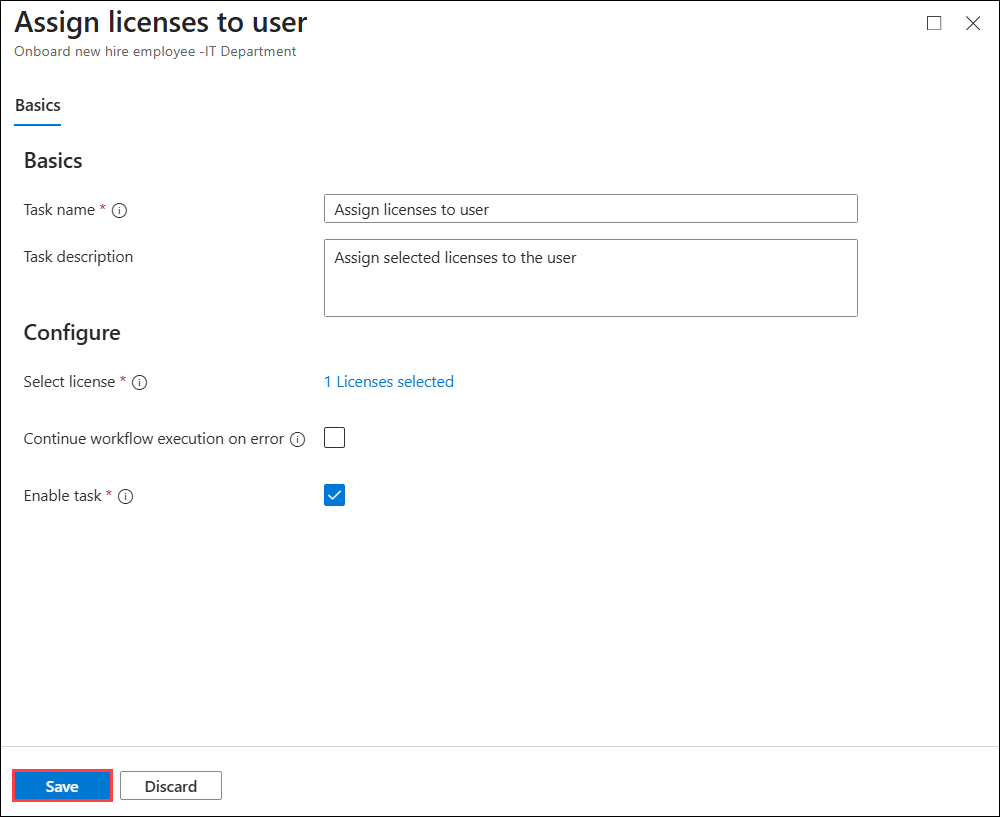

1. Now click on **Add user to group (1)** then click on **0 group selected (2)**

   

1. Select **New joiners (1)** group and the click on **Select (2)**

   

1. Click on **Save (1)**.

1.  Review the order of tasks. Drag tasks to reorder them if needed. Recommended order:
      - Enable user account
      - Send welcome email
      - Add user to groups
      - Generate TAP and send Email
      - Assign license to User

1. Click **Next: Review + create (2)**.

   

1. Review the workflow configuration summary and click **Create**.

   

### Task 2.2: Implement Custom Extensions

In this task, you will create a custom task extension using a Logic App. This extension will be integrated into the lifecycle workflow to perform additional actions, such as sending notifications, and you will test its execution.

1. In the Microsoft Entra admin center, expand **ID Governance (1)** in the left navigation pane and select **Lifecycle workflows (2)**.

1. Select **Custom extensions (3)**, then click on **+ Add a custom extension (4)**.

   

1. On the Basics tab, Provide the below details then click on **Next Task behavior (3)**

      - **Name**: Onboarding email notification **(1)**
      - **Description**: Send the onboarding email notification to New joinee **(2)**.

      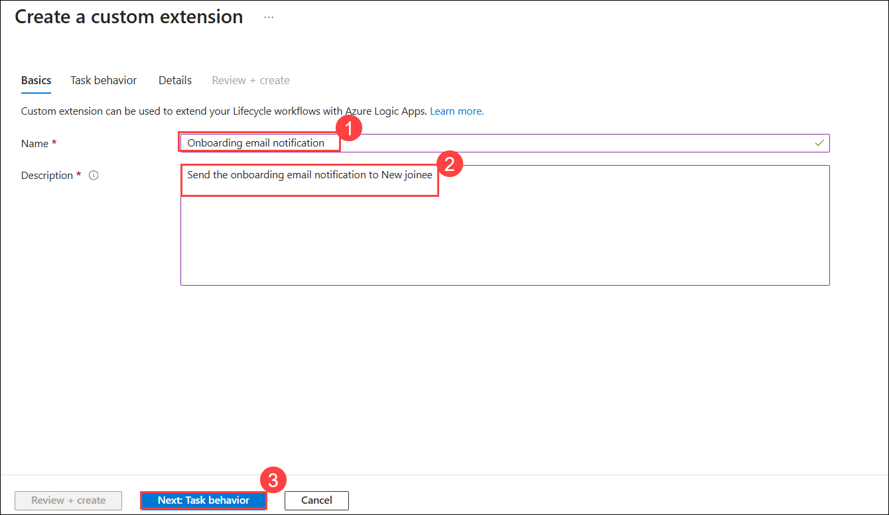

1. On the Task behavior tab, leave it as default and click on **Next Details**

   

1. On the Details page, Provide the below details and click on **Create logoc app(4)**
      - **Subscription**: Leave it as default **(1)**
      - **Resource group**:  **(2)**
      - **Logic app name**: `custom-task-workflow` **(3)**
   

1. Once the deployment is successful, click on **Next Review + create** and then click on **Create**.

   

1. Now go to custom extensions and click on **custom-task-workflow**

   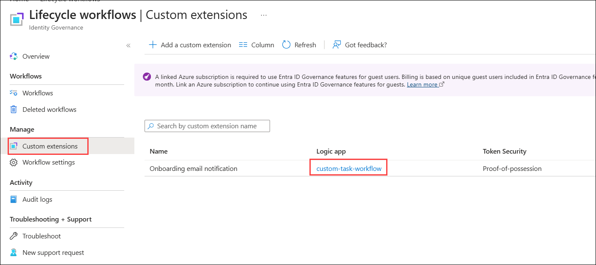

1. Copy the below code. Click on **Logic app code view (1)** then select all the existing code with **Ctrl + A** and then clcik **Ctrl + V** to paste the code and then click on **Save (3)** to save the code

   ```
   {
    "definition": {
        "$schema": "https://schema.management.azure.com/providers/Microsoft.Logic/schemas/2016-06-01/workflowdefinition.json#",
        "contentVersion": "1.0.0.0",
        "triggers": {
            "manual": {
                "type": "Request",
                "kind": "Http",
                "inputs": {
                    "schema": {
                        "properties": {
                            "data": {
                                "properties": {
                                    "callbackUriPath": {
                                        "description": "CallbackUriPath used for Resume Action",
                                        "title": "Data.CallbackUriPath",
                                        "type": "string"
                                    },
                                    "subject": {
                                        "properties": {
                                            "displayName": {
                                                "description": "DisplayName of the Subject",
                                                "title": "Subject.DisplayName",
                                                "type": "string"
                                            },
                                            "email": {
                                                "description": "Email of the Subject",
                                                "title": "Subject.Email",
                                                "type": "string"
                                            },
                                            "id": {
                                                "description": "Id of the Subject",
                                                "title": "Subject.Id",
                                                "type": "string"
                                            },
                                            "manager": {
                                                "properties": {
                                                    "displayName": {
                                                        "description": "DisplayName parameter for Manager",
                                                        "title": "Manager.DisplayName",
                                                        "type": "string"
                                                    },
                                                    "email": {
                                                        "description": "Mail parameter for Manager",
                                                        "title": "Manager.Mail",
                                                        "type": "string"
                                                    },
                                                    "id": {
                                                        "description": "Id parameter for Manager",
                                                        "title": "Manager.Id",
                                                        "type": "string"
                                                    }
                                                },
                                                "type": "object"
                                            },
                                            "userPrincipalName": {
                                                "description": "UserPrincipalName of the Subject",
                                                "title": "Subject.UserPrincipalName",
                                                "type": "string"
                                            }
                                        },
                                        "type": "object"
                                    },
                                    "task": {
                                        "properties": {
                                            "displayName": {
                                                "description": "DisplayName for Task Object",
                                                "title": "Task.DisplayName",
                                                "type": "string"
                                            },
                                            "id": {
                                                "description": "Id for Task Object",
                                                "title": "Task.Id",
                                                "type": "string"
                                            }
                                        },
                                        "type": "object"
                                    },
                                    "taskProcessingResult": {
                                        "properties": {
                                            "createdDateTime": {
                                                "description": "CreatedDateTime for TaskProcessingResult Object",
                                                "title": "TaskProcessingResult.CreatedDateTime",
                                                "type": "string"
                                            },
                                            "id": {
                                                "description": "Id for TaskProcessingResult Object",
                                                "title": "TaskProcessingResult.Id",
                                                "type": "string"
                                            }
                                        },
                                        "type": "object"
                                    },
                                    "workflow": {
                                        "properties": {
                                            "displayName": {
                                                "description": "DisplayName for Workflow Object",
                                                "title": "Workflow.DisplayName",
                                                "type": "string"
                                            },
                                            "id": {
                                                "description": "Id for Workflow Object",
                                                "title": "Workflow.Id",
                                                "type": "string"
                                            },
                                            "workflowVersion": {
                                                "description": "WorkflowVersion for Workflow Object",
                                                "title": "Workflow.WorkflowVersion",
                                                "type": "integer"
                                            }
                                        },
                                        "type": "object"
                                    }
                                },
                                "type": "object"
                            },
                            "source": {
                                "description": "Context in which an event happened",
                                "title": "Request.Source",
                                "type": "string"
                            },
                            "type": {
                                "description": "Value describing the type of event related to the originating occurrence.",
                                "title": "Request.Type",
                                "type": "string"
                            }
                        },
                        "type": "object"
                    }
                }
            }
        },
        "actions": {
            "HTTP": {
                "runAfter": {},
                "type": "Http",
                "inputs": {
                    "uri": "https://graph.microsoft.com/beta@{triggerBody()?['data']?['callbackUriPath']}",
                    "method": "POST",
                    "body": {
                        "data": {
                            "operationStatus": "Completed"
                        },
                        "source": "sample",
                        "type": "lifecycleEvent"
                    },
                    "authentication": {
                        "audience": "https://graph.microsoft.com",
                        "type": "ManagedServiceIdentity"
                    }
                }
            },
            "Send_an_email_(V2)": {
                "runAfter": {
                    "HTTP": [
                        "Succeeded"
                    ]
                },
                "type": "ApiConnection",
                "inputs": {
                    "host": {
                        "connection": {
                            "name": "@parameters('$connections')['office365']['connectionId']"
                        }
                    },
                    "method": "post",
                    "body": {
                        "To": "@triggerBody()?['data']?['subject']?['email']",
                        "Subject": "Welcome Onboarding",
                        Body": "<p class=\"editor-paragraph\">Hello Dear @{triggerBody()?['data']?['subject']?['displayName']},<br><br>Welcome to your first day at work.<br><br>Attached, you will find the information for your first login:<br>Use the following username to log in:<br>@{triggerBody()?['data']?['subject']?['email']}<br><br>Set it up here: <a href=\"https://portal.office.com\" class=\"editor-link\">portal.office.com</a><br><br>If you have any questions, please contact your manager:<br>@{triggerBody()?['data']?['subject']?['manager']?['displayName']}<br>@{triggerBody()?['data']?['subject']?['manager']?['email']}<br><br>You can reach our helpdesk at 00011112222<br>Welcome “On-Board”!</p>",
                        "Cc": "@triggerBody()?['data']?['subject']?['manager']?['email']",
                        "Importance": "Normal"
                    },
                    "path": "/v2/Mail"
                }
            }
        },
        "outputs": {},
        "parameters": {
            "$connections": {
                "type": "Object",
                "defaultValue": {}
            }
        }
    },
    "parameters": {
        "$connections": {
            "type": "Object",
            "value": {
                "office365": {
                    "id": "/subscriptions/ecbef7ad-49f5-464f-b511-51b084562ecd/providers/Microsoft.Web/locations/eastus/managedApis/office365",
                    "connectionId": "/subscriptions/ecbef7ad-49f5-464f-b511-51b084562ecd/resourceGroups/ODL-DFC-2199368/providers/Microsoft.Web/connections/office365",
                    "connectionName": "office365",
                    "connectionProperties": {}
                }
            }
        }
    }
   }
   ```

   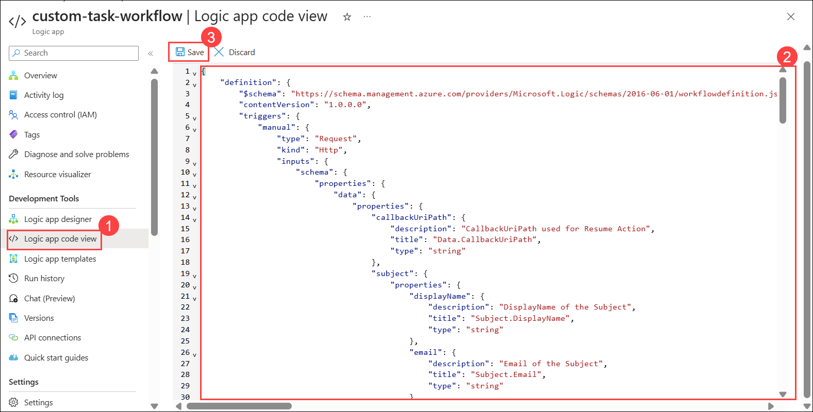

1. In the left pane, go to **Logic app designer** and check the flow of logic app

   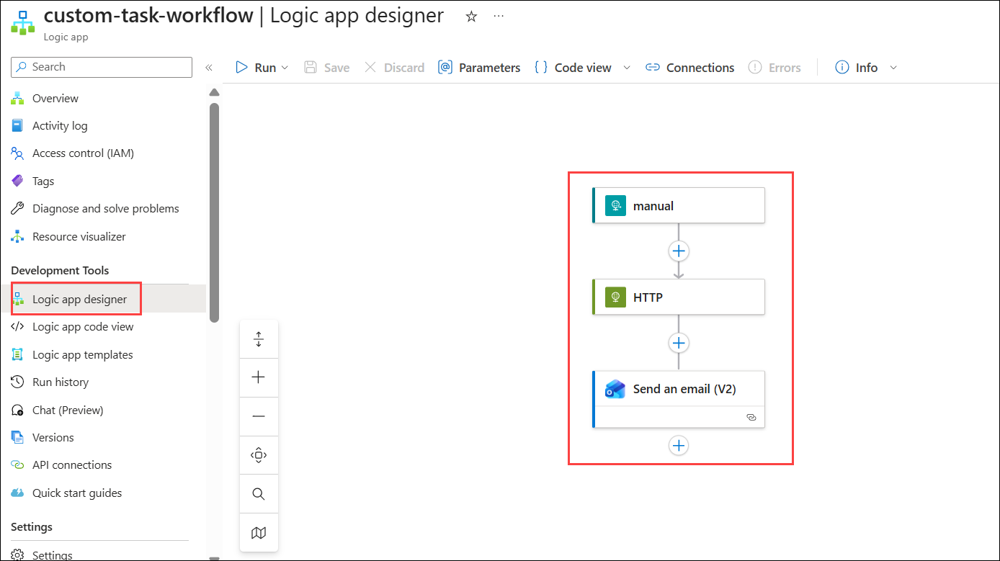

   >**Note**: The manual step is the trigger that starts the Logic App when the lifecycle workflow sends a request. The HTTP action processes the request and marks the task as completed, and the Send an email (V2) step sends a notification to the user and manager.

1. Now go to **Identity (1)** and make the status **On (2)** then click on **Save(3)**.

   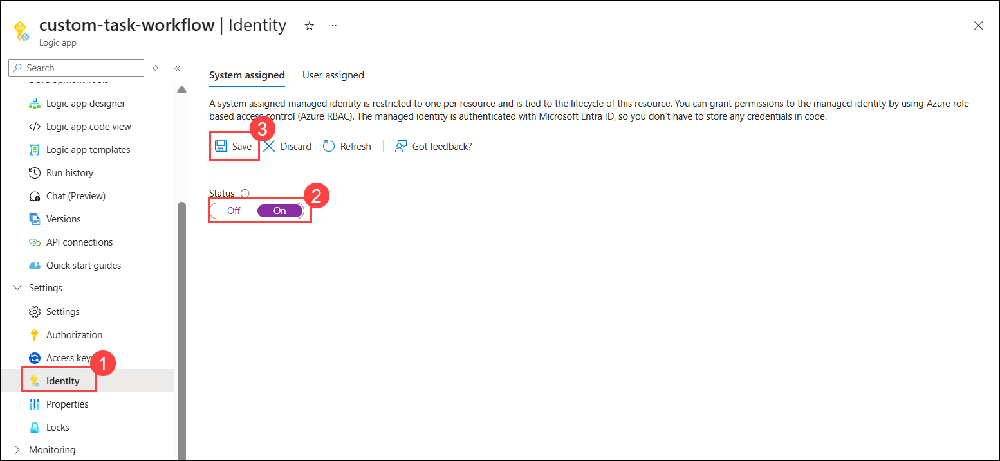

1. In the Microsoft Entra admin center, expand **ID Governance (1)** in the left navigation pane and select **Lifecycle workflows (2)**.

1. Select **Workflows (3)**, then click on **Onboard New Employee - IT Department (4)**.

   

1. Click **Tasks (1)** in the workflow menu and then click **+ Add task (2)**.

   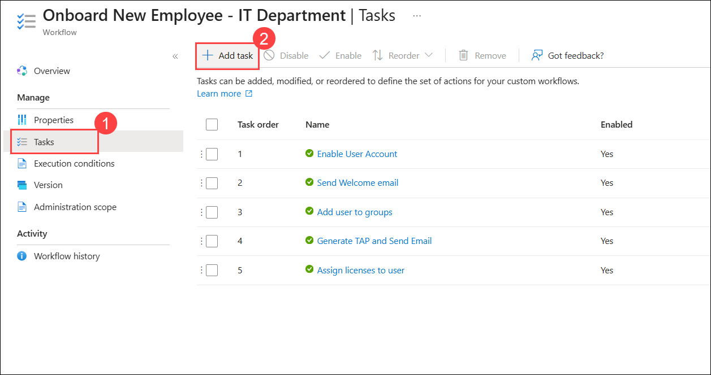

1. Select **Run a Custom Task Extension (1)** from the task list and click on **Save (2)**.

   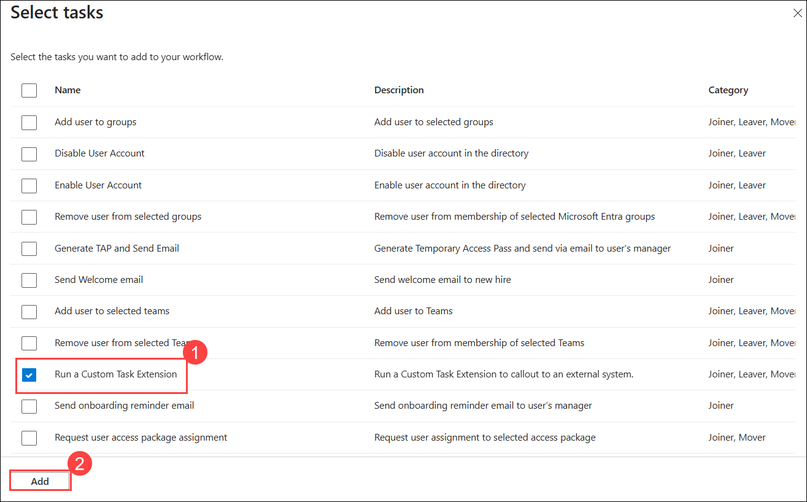

1. Click on **Run a Custom Task Extension (1)** , Select custom extension as **Onboarding email notification (2)** then click on **Save(3)**.

   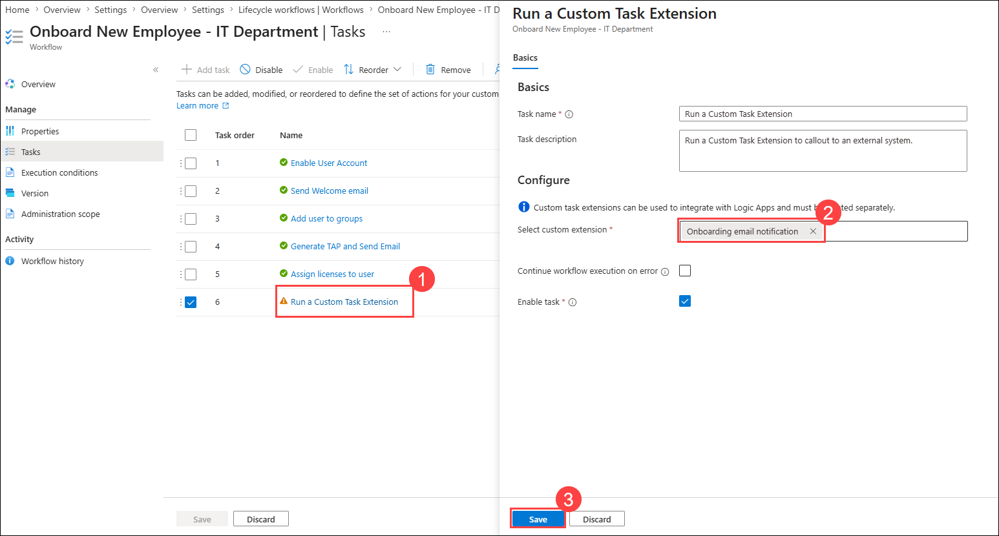

1. Then Click **Save**.

   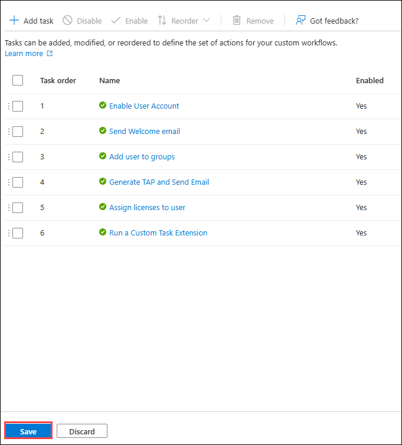

1. Before running the Lifecysle workflow, you need to updated few properties of the user.

1. Navigate to **Users (1)** under Entra ID and click on **ADUser3 (2)**.

   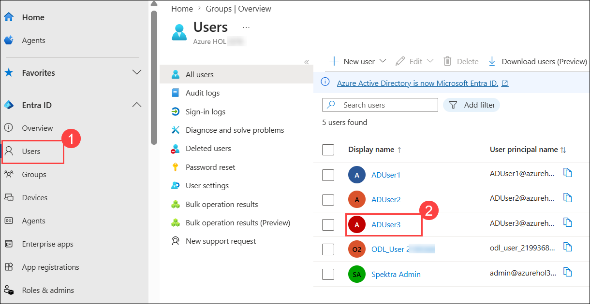

1. Click **Edit properties**.

   

1. Select **All** then scroll down and set the following attributes and then click on **Save (4)**

   - **Employee Hire date**: Select today's date **(1)**
   - **Manager**: <inject key="AzureEmail"></inject> **(2)**
   - **Email**:<inject key="AzureAdUser3Email"></inject> **(3)**

    
    

1. Now expand **ID Governance (1)** in the left navigation pane and select **Lifecycle workflows (2)**. Select **Workflows (3)**, then click on **Onboard New Employee - IT Department (4)**.

   

1. Go to **Overview (1)** and select **Run on demand (2)**. 

   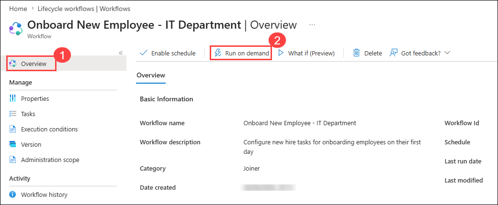

1. Click on **+ Select user (1)** then select the **ADUser3 (2)** and click on **Select (3)**.

   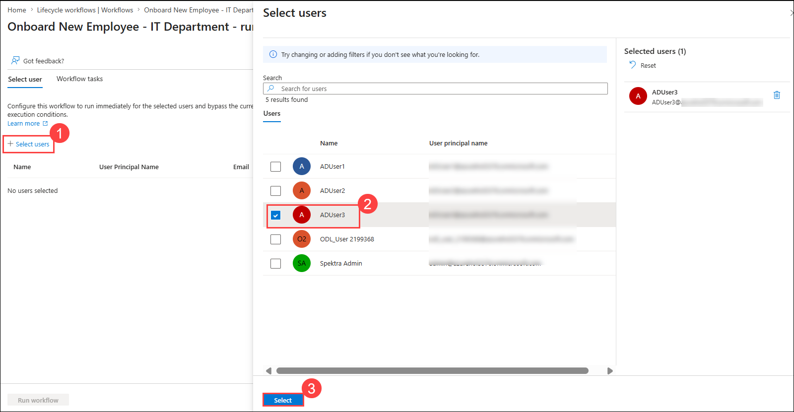

1. Click **Run workflow**.

   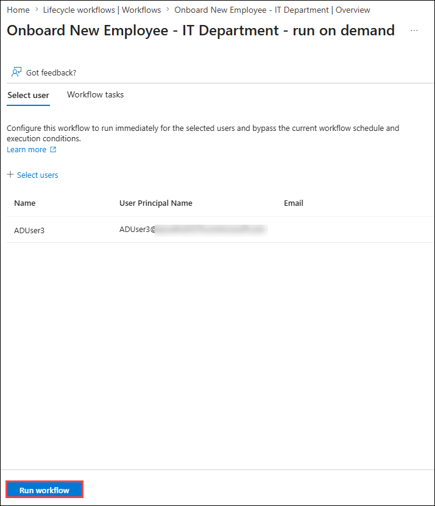

1. Refresh it and after few minutes,. click on **ADUser3** and check each task shows a **Completed** status.

   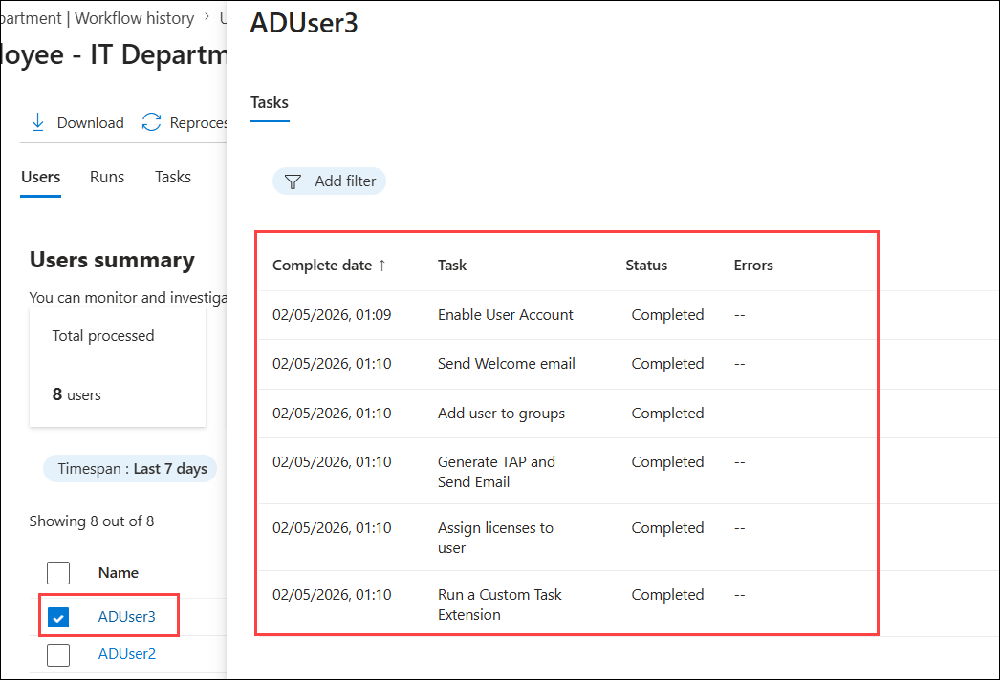

1. Navigate to **Users (1)** under Entra ID and click on **ADUser3 (2)**.

   

1. Now click on **Group** to check the user has been assigned to the group **Newjoiner** and also check **license** that has been assigned to the user.

   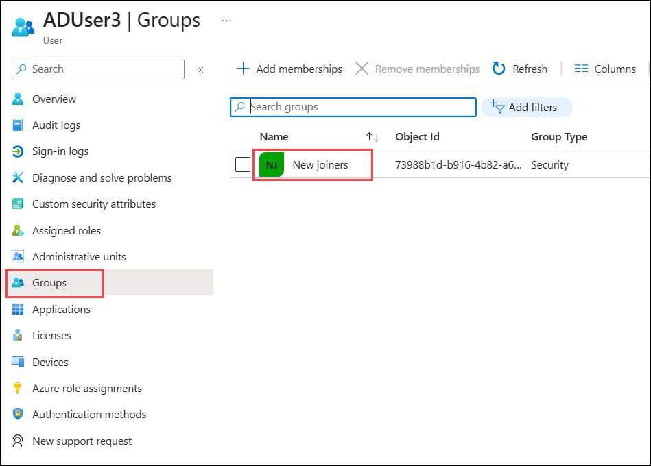
   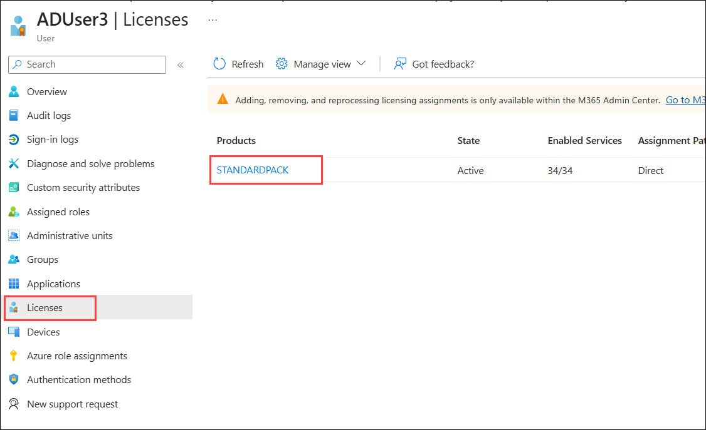

1. Open a new tab and navigate to outlook using below link

   ```
   https://outlook.office.com/
   ```
1. If prompted to sign, provide the credentials below:

   - **Email/Username:** <inject key="AzureAdUserEmail"></inject>

   - **Password:** <inject key="AzureAdUserPassword"></inject>

   

1. Navigate back to **Microsoft entra admin portal** and select **users** under Entra ID and click on **ADUser3**.

   

1. Now click on **Group** to check the user has been assigned to the group **Newjoiner** and also check **license** that has been assigned to the user.

   
   

### Task 2.3: Configure Offboarding Workflow

In this task, you will configure a lifecycle workflow to handle employee offboarding. You will automate tasks such as removing licenses, disabling accounts, and cleaning up group memberships, and validate the complete offboarding process.

1. In the Microsoft Entra admin center, expand **ID Governance (1)** in the left navigation pane and select **Lifecycle workflows (2)**. Then click on **+ Create workflow (3)**

   

1. Scroll down and select the **Offboard an employee** template under the **Leaver** category.

   

1. On the **Basics** page, leave it as default and click **Next: Configure**.

   

1. On the **Configure** page, Make the rule department value as **IT (1)** then click **Next: Review tasks (2)**.

   

1. On the **Review tasks** page, you will see pre-configured tasks. Click **+ Add task (1)** to add additional tasks.

1. Select **Remove all licenses for user  (2)** then click on **Add (3)** and click **Next: Review tasks (4)**.

   

 Review the order of tasks. Drag tasks to reorder them if needed. Recommended order:
   1. Disable user account
   2. Remove user from all groups
   3. Remove user from all Teams
   4. Remove all licenses for user

1. Click **Create**.

   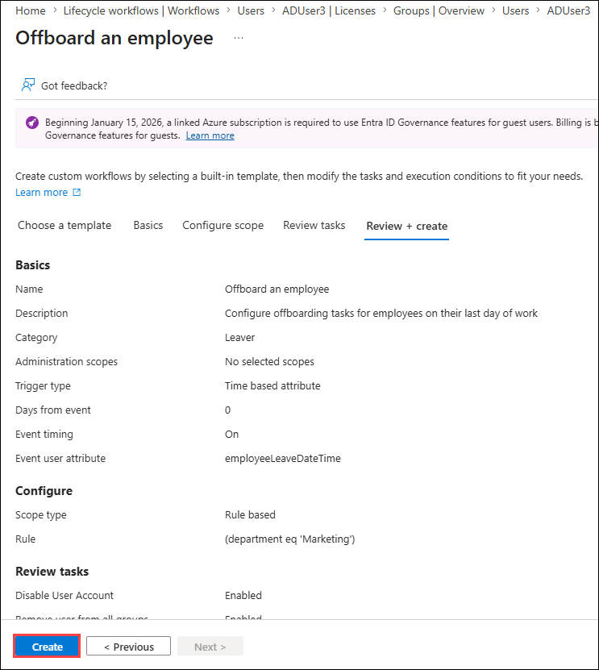

1. Now select **Offboard an employee** and click on **Run on demand**.

   

1. Click on **+ Select users (1)** then select **ADUser3 (2)** and click **Select (3)**.

   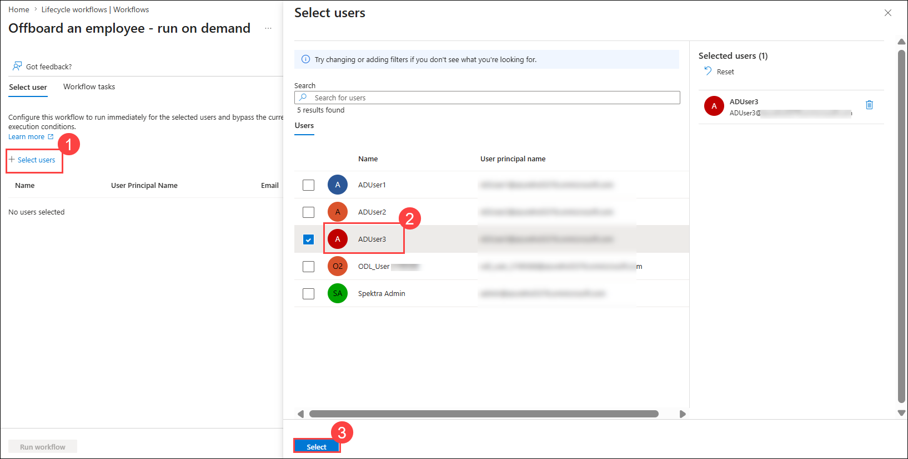

1. Now click on **Run workflow**.

   

1. Refresh it and after few minutes,. click on **ADUser3** and check each task shows a **Completed** status.

   

1. Navigate to **Users (1)** under Entra ID and click on **ADUser3 (2)**.

   

1. Verify the **Groups Memberships (1)** and **License (2)** of the **ADUser3** has been revoked and account is **disabled (3)**.

   

## Task 3: Setting Up Access Reviews

In this task, you will create and configure access reviews to regularly validate user access to groups or applications. You will define reviewers, schedules, and perform approval or denial actions while reviewing audit logs.

1. In the Microsoft Entra admin center, navigate to **ID Governance** and select **Access reviews** then click on **+ Access reviews**

   

1. Select **Review access to a resource type**

   

1. On the **Review type** page, provide the below details:
      - Select what to review :**Teams + Groups (1)**
      - Review scope : **Select Teams + groups (2)**
      - Group : click on **+ Select groups (3)**

   

1. Select **IT-Department (1)** and click on **Select (2)**.

   

1. Select **All users (1)** on the scope and click on **Next Reviews (2)**.

   

1. In the select reviewers drop down, click on **Selected user(s) or group(s)**

   

1. Then click on **+ select reviwers (1)** and select **ODL_User <inject key="DeploymentID"></inject> (2)** then clcik on **select (3)**.

   

1. Now select review occurence as **Weekly (1)** then click on **Next settings (2)**

   

1. Click on **Next Review + Create**

1. On the **Review + create** page, provide Review name as **Access review (1)** and click on **Create (2)**.

   

1. The designated reviewer will receive an email notification to perform the review.

1. Open a new tab and navigate to outlook using below link

   ```
   https://outlook.office.com/
   ```
1. If prompted to sign, provide the credentials below:

   - **Email/Username:** <inject key="AzureAdUserEmail"></inject>

   - **Password:** <inject key="AzureAdUserPassword"></inject>

1. You will receive a mail. Select the mail and click on **Start review**.

   

1. It will navigate to my access portal.

1. Now select **ADUser1** and click on **Deny**. Optionally, provide a justification in the **Reason** field and **Sumbit**.

   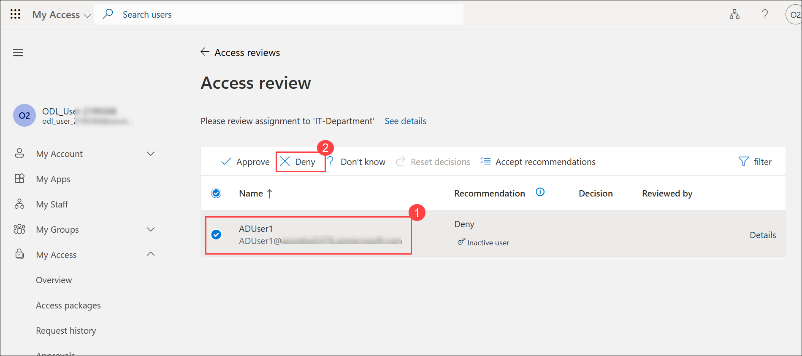
   

1. Navigate back to Entra admin portal and select **Access review**

   

1. Now click on **Results** to see the denied log.

   

## Task 4: Implementing Conditional Access Policies

In this task, you will create a Conditional Access policy to enforce multi-factor authentication (MFA). You will configure conditions such as users, apps, and locations, and validate the policy using sign-in logs.

1. In the Entra Admin portal left pane, expand **ID Protection (1)** and select **Risk-based Conditional Access  (2)** then click on **+ New policy (3)**.

   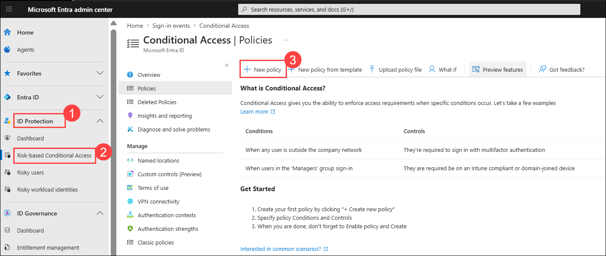

1. Configure the Conditional Access Policy with the following details:

      - Name: **Require MFA for IT Department - Cloud Apps** **(1)**
      - Click on **0 users or agents (Preview) selected** **(2)** under Users or agents (Preview) option.
      - A new window will slide in, click on **Select users and Groups** **(3)** and then select the check box saying **Users and groups** **(4)**
      - Now a Select window will open, here select **IT-Department** and then click on **Select** **(5)** button.
   
         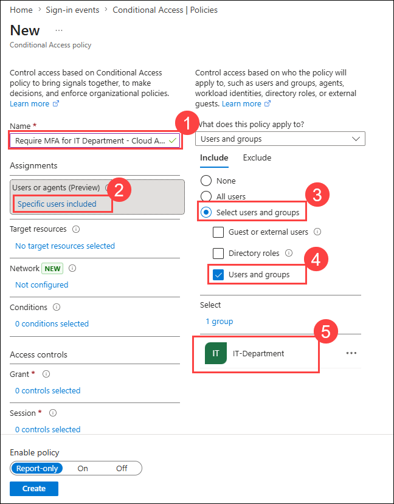
   
      - Click on **No target resources selected** **(1)** under Target resources option.
      - Click on **All resources (formally All cloud apps)** **(2)**

         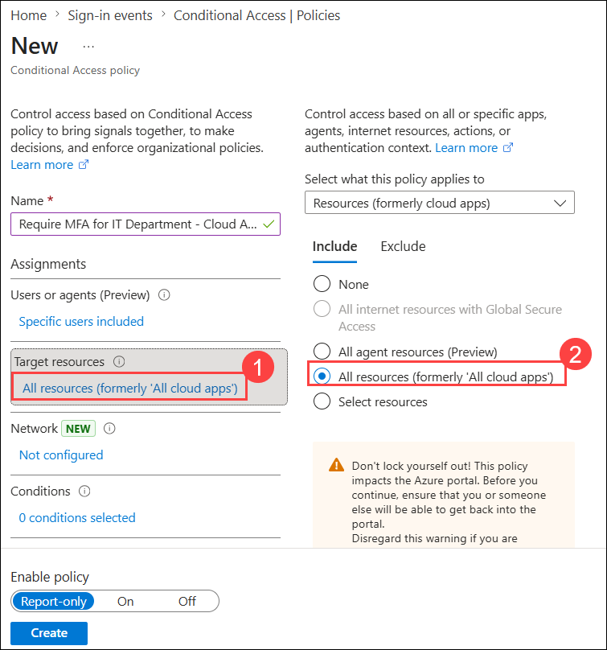

      - Click on **0 conditions selected** **(1)** under Conditions option.
      - Then select **Device platforms** **(2)**
      - Now in the Device platforms blade, toggle the *Configure* switch to **Yes** **(3)** and make sure that all the checkboxes below are selected.
      - Then click on **Done** **(4)**

         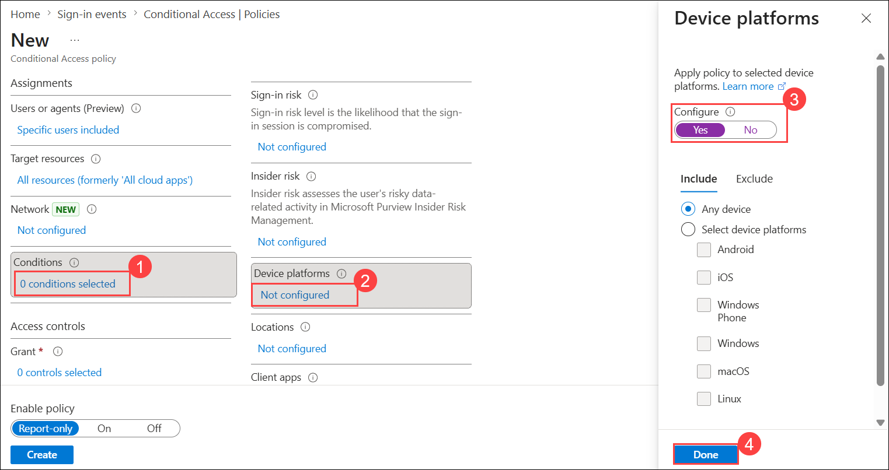

      - Then select **Location** **(1)**
      - Now in the Location blade, toggle the *Configure* switch to **Yes** **(2)** and select **Any network or location **(3)**.

         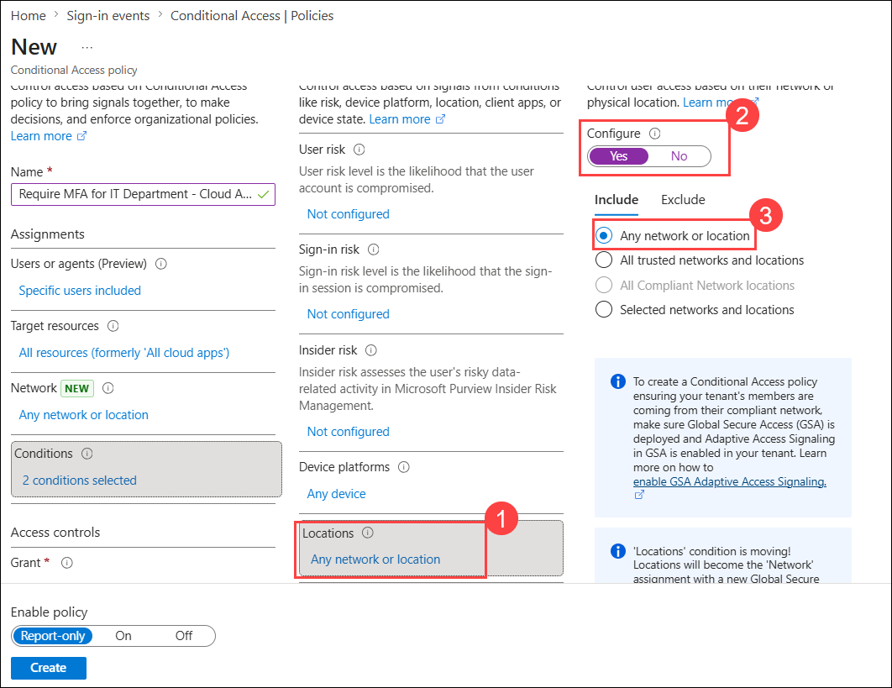
  
      - Then select **Client Apps** **(1)**
      - Now in the Client Apps blade, toggle the *Configure* switch to **Yes** **(2)** and make sure that all the checkboxes below are selected.
      - Then click on **Done** **(3)**.

         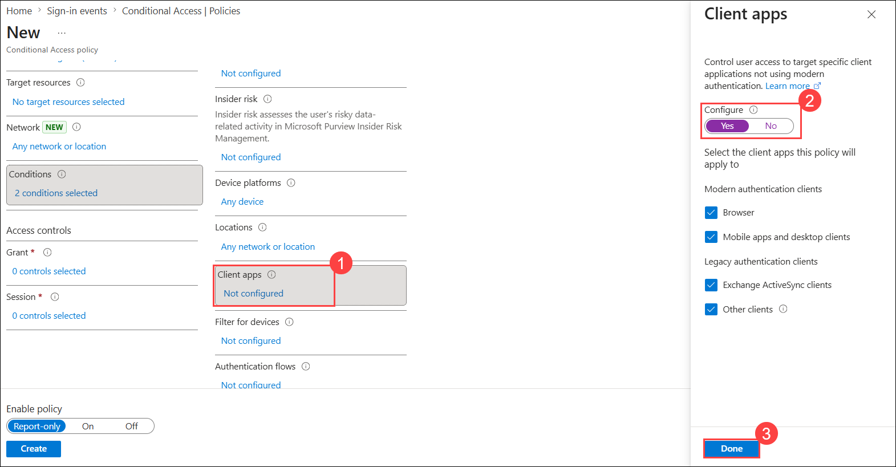

      - Click on **0 controls selected (1)** of `Grant` Section under the Access Control option.
      - in the **Grant** pane, click on **Grant access**
      - Select the check Box saying **Require multi-factor authentication** **(2)** 
      - Then click on **Select** **(3)**

         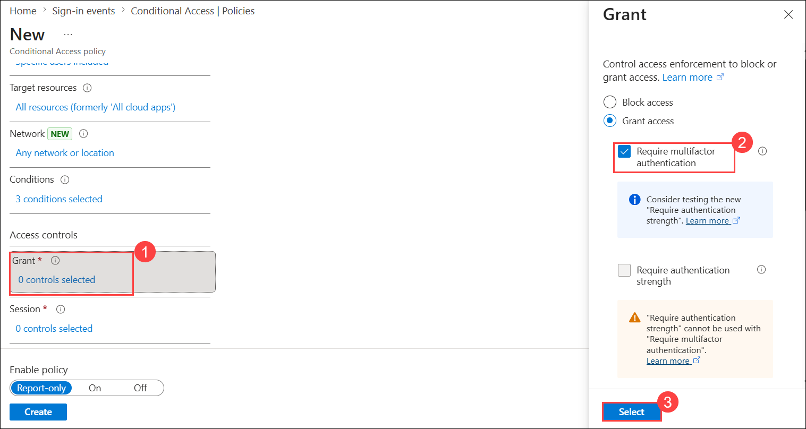
   
      - Toggle the **Enable Policy** switch to **On (1)** and click on **Create (2)**.

        

1. Open an **Incognito browser**, paste the provided link, and log in using below **credentials**.

      ```
      portal.azure.com
      ```

   - Username: Paste the username  **<inject key="ADUser1 Email"></inject>** then click on **Next**.

         

   - Password:  Paste the password **<inject key="ADUser Password"></inject> (1)** and click on **Sign in (2)**.

         

1. If you see the **Action Required** pop up, click on **Ask later.**

   >**Note:** If there's a dialog box saying **Stay signed in**, then select the **No** option.

         

     >**Note:** Follow the below steps, if MFA prompted:

     - Click **Next** in **Lets keep your account secure**.
     - On **Install Microsoft Authenticator**, click **Next**.

           

     - Click **Next**.

            

     - In **android**, go to the play store and Search for **Microsoft Authenticator** and Tap on **Install**.      

           

        >Note: For iOS, open the App Store and repeat the steps.

        >Note: Skip if already installed.       

     - Open the app and tap on **Scan a QR code**.

     - Scan the QR code visible on the screen **(1)** and click on **Next (2)**.

       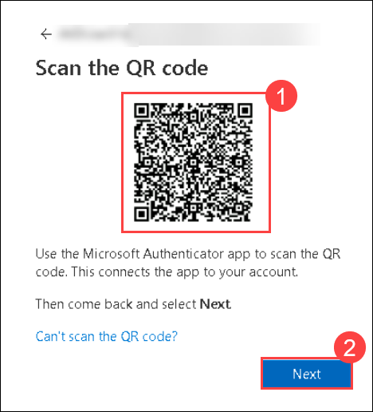   

     - Enter the digit displayed on the Screen in the Authenticator app on your mobile and tap on **Yes**.

              

     - Once the notification is approved, click on **Next**.

     - Click on **Done**.

       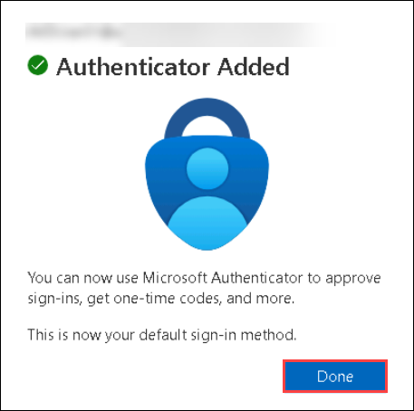        

1. If prompted to stay signed in, you can click **"No"**.

1. Tap on **Finish** in the Mobile Device.

   > NOTE: While logging in again, enter the digits displayed on the screen in the **Authenticator app** and click on Yes.

1. Return to the Microsoft Entra admin center and navigate to **Entra ID** > **Monitoring & health** > **Sign-in logs**.

1. Verify the recent sign-ins

   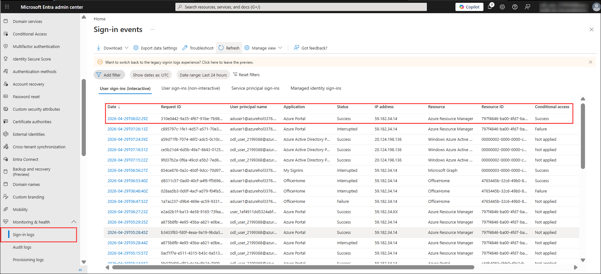

## Task 5: Monitoring and Auditing with Entra ID (Optional/Read Only)

In this task, you will explore audit logs, sign-in logs, and reporting dashboards to monitor identity activities. This helps in gaining visibility into governance operations and improving security posture.

1. In the Microsoft Entra admin center, navigate to **Entra ID** > **Monitoring & health** > **Audit logs**.

1. Review the Audit logs activity across your tenant.

   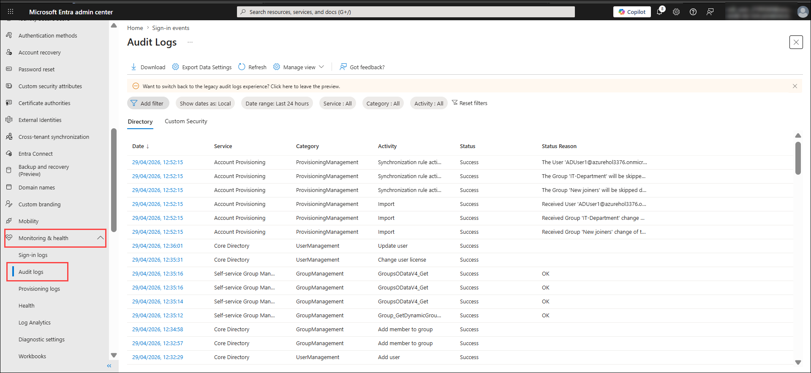

1. Navigate to **Sign-in logs**.

1. Review the sign-in activity across your tenant.

   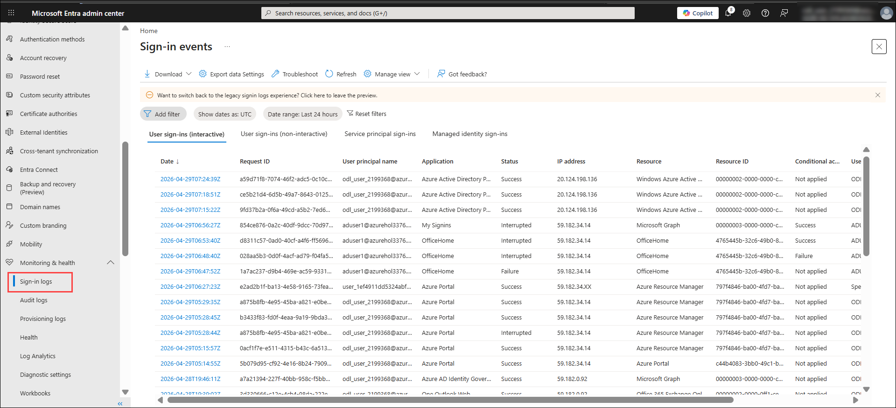

1. Apply filters to find interesting 

1. Navigate to **Home** to see the tenant summary dashboard.

   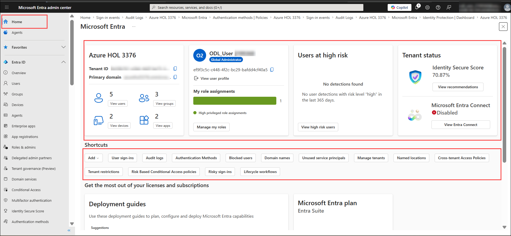

## Summary

In this exercise, you implemented key Identity Governance capabilities in Microsoft Entra ID, including dynamic group-based access, automated onboarding and offboarding workflows, and automatic license provisioning. You also integrated a custom Logic App extension, performed access reviews, and enforced security through Conditional Access with MFA. Additionally, you monitored activity using audit and sign-in logs. Together, these features establish a strong foundation for a modern Identity Governance and Administration (IGA) solution.

Now, click on Next from the lower right corner to move on to the next page.

   
