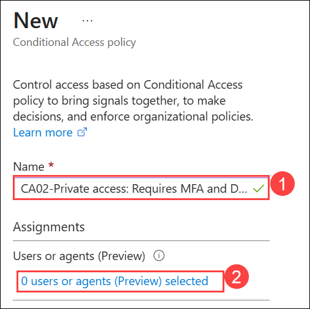
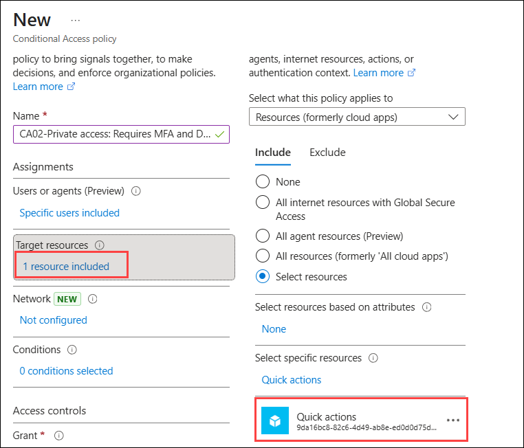
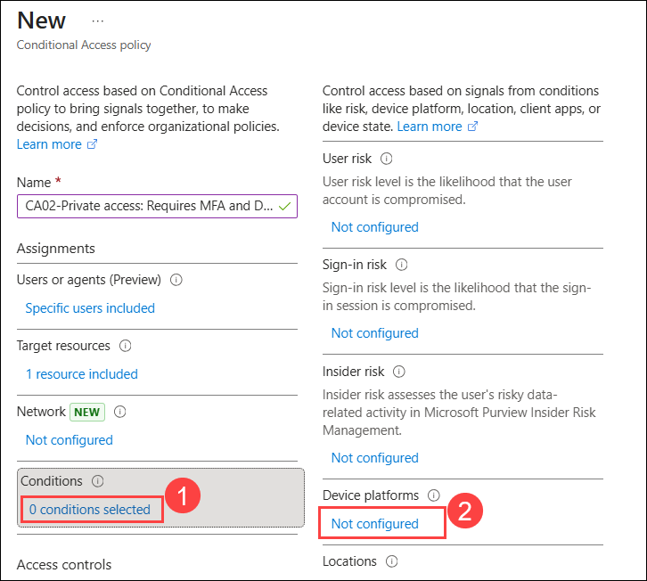
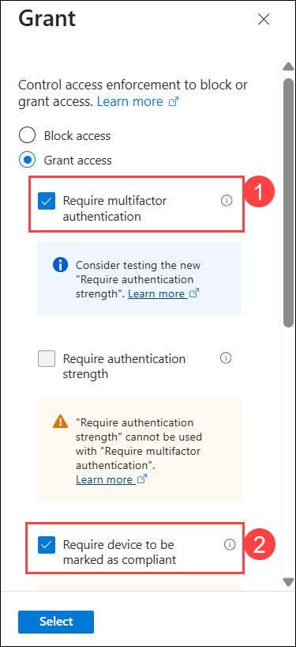
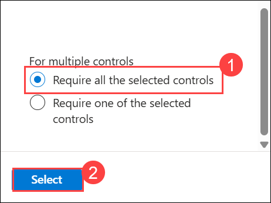
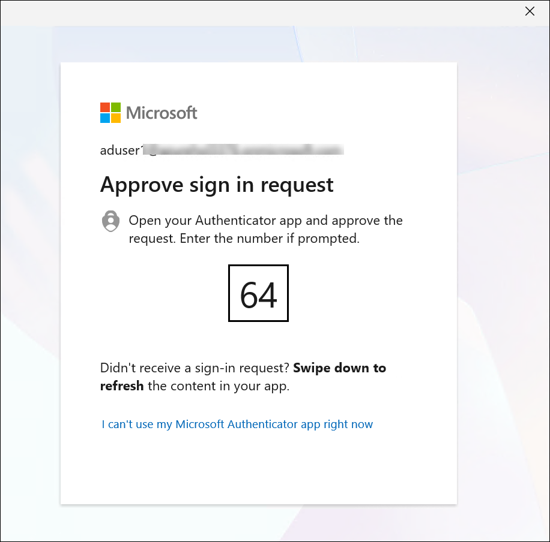
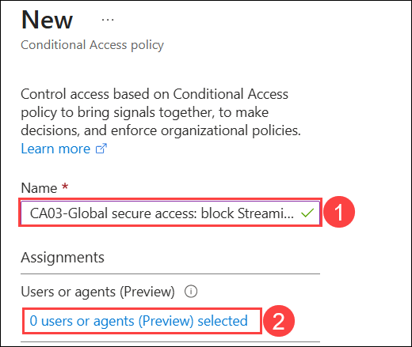
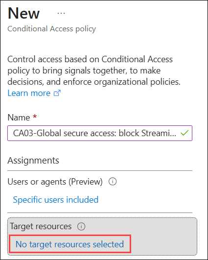
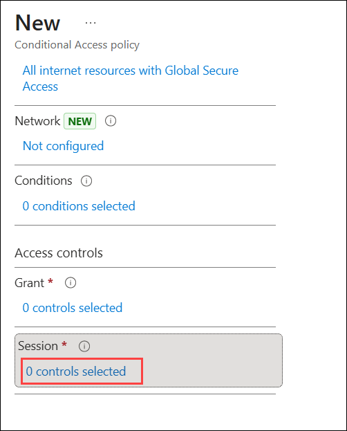
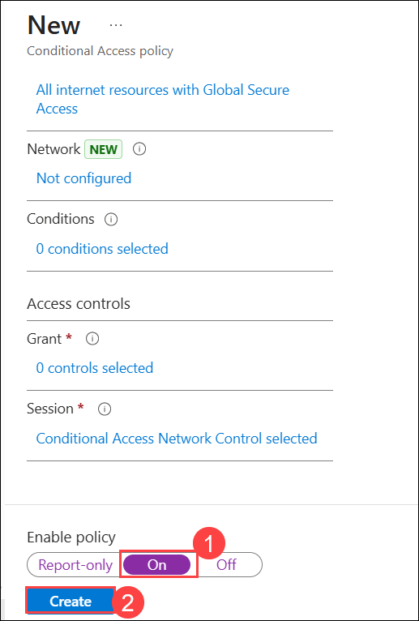

# Exercise 2: Microsoft Entra Global Secure Access (Internet & Private Access)

## Estimated Duration: 60 minutes

## Overview

In this hands-on exercise, you will configure **Microsoft Entra Global Secure Access** to securely manage access to private and internet resources. You will enable the service, install the client, and set up Private Access to connect to internal resources without a VPN. You will apply **Conditional Access Policies** to enforce security controls and configure Internet Access for web filtering. Finally, you will validate connectivity and review logs to ensure configured policies are working as expected.

## Prerequisites

The following are prerequisites to complete this exercise:

- Microsoft Entra ID P1 or P2 license.
- **Microsoft Entra Internet Access** and **Microsoft Entra Private Access** licenses (included in Microsoft Entra Suite).
- Global Administrator or Security Administrator role.
- A Windows 10/11 device that is either **Microsoft Entra joined** or **Microsoft Entra hybrid joined**.
- For Private Access: An on-premises server or Azure VM to act as the Private Access connector host.
- Internet connectivity from the connector server to Microsoft Entra.

## Lab Objectives

In this lab, you will complete the following exercise:

- Task 1: Enable Microsoft Entra Global Secure Access
- Task 2: Configure Entra Private Access
- Task 3: Apply Conditional Access Policies to Private Access
- Task 4: Configure Entra Internet Access
- Task 5: Validate Access and Review Logs

## Task 1: Enable Microsoft Entra Global Secure Access

Microsoft Entra Global Secure Access is Microsoft's Security Service Edge (SSE) solution that combines identity-aware network security with Zero Trust network access. It provides two core capabilities:

- **Microsoft Entra Private Access**: Replaces traditional VPN by providing Zero Trust access to private/on-premises resources.
- **Microsoft Entra Internet Access**: Provides Secure Web Gateway (SWG) capabilities for internet-bound traffic.

In this task, you will activate **Microsoft Entra Global Secure Access** in your tenant and configure the environment to securely access both private and internet-based resources. You will also download the **Global Secure Access** client, which will be used in later tasks to connect endpoint devices securely.

1. In the left navigation pane, expand **Global Secure Access (1)** then select **Dashboard (2)** and click on **Activate (3)**.

   

1. Once activated, you will get a notification **Tenant activation is completed successfully**.

   

1. On your **LabVM Desktop**, click on **Start** menu, search for **RDP (1)** and select **Remote Connection Desktop (2)**.

   

1. Provide **Computer** name as <inject key="ClientVM DNS Name"></inject> **(1)** then click on **Connect (2)**.

   

1. Now click on **More choices (1)** then select **Use a different account (2)**. Provide the below credentials and click on **OK (5)**.

      - **Username** :  .\ <inject key="ClientVM Admin Username"></inject> **(3)**
      - **Password** : <inject key="ClientVM Admin Password"></inject> **(4)**

         

1. Now, click on **Yes** to connect to the **Client VM**.

      

   >**Note**: A window will appeat to Choose privacy setting for your device, click on **Next** and then **Accept**.
      

1. On the **Start** menu, search for **settings (1)** and click on **Settings (2)**.

      

1. Navigate to **Accounts (1)** and select  **Access work or school (2)** to continue.

      

1. Then click on **Connect** to add your organizational account.

      

1. Click on **Join this device to Microsoft Entra ID** to join the device to Entra ID.

      

1. It will prompt to **Sign in**. Provide the below credentials:

   - **Username:** <inject key="AzureAdUserEmail"></inject> **(1)** and click on **Next (2)** to continue.

         

   - **Password:** <inject key="AzureAdUserPassword"></inject> **(1)** and click on**Sign in (2)**.

        

1. Click on **Join** to connect, and then select **Done** to complete the process.

      
      

1. On the **Start** menu, search for **cmd (1)** and click on **Command Prompt (2)**.

      

1. Paste the below command **(1)** and check the status of the device as **AzureADjoined (2)**.

   ```
   dsregcmd /status
   ```

      

1. Once it is done, minimize the Client VM.

      

## Task 2: Configure Entra Private Access

In this task, you will configure **Microsoft Entra Private Access** by enabling traffic forwarding and deploying a **Private Access connector**. You will create an application segment and assign users to securely access internal resources. Finally, you will validate connectivity by accessing a private resource (RDP) through the Global Secure Access client without using a traditional VPN.

1. In the **Microsoft Entra admin center** on the Lab VM, go to **Traffic forwarding (1)**, enable the **Private access profile (2)**, and then click **OK** in the confirmation pop-up wizard.

   

   

1. Once it is enabled, click on **View (3)** to add the user and group assignments.

   

1. Enable **Assign to all users (1)** toggle. In the pop-up window, click **OK (2)**, and once the setting is enabled, select **Done (3)**.

   

   

   

1. Now, navigate to **Connectors and sensors (1)** and click **Download connector service (2)** to download the Private Access connector installer.

   

1. Click on **Accept terms & Download** to download the installer.

   

1. Once installer file is downloaded, click on **Open file**

   

1. Check the box **(1)** to accept the license terms and conditions then click on **Install (2)**.

   

1. While installing, it will prompt you to **Sign in**. Provide the below credentials:

   - **Username:** <inject key="AzureAdUserEmail"></inject> in the **Sign in (1)** field and click **Next(2)** to continue.

         

   - **Password:** <inject key="AzureAdUserPassword"></inject> **(1)** and click on **Sign in (2)**.

        

1. Once installation is completed, click on **Close**.

    

1. Navigate to **Microsoft Entra admin portal** to check the **Connectors** status as **Active**.

    

   >**Note**: If the connector is not appeared, refresh the browser and check again.

1. Navigate to **Applications (1)** then select **Quick Access (2)**. Enter  **Quick actions (3)** as Name, and then click on **+ Add Quick Access application segment (4)**.

    

1. Provide the below details, and click **Apply (5)** to add the segment.

   - **Destination type**: `IP address` **(1)**
   - **IP address**: `10.0.0.1/24` **(2)**
   - **Ports**: `3389`  **(3)**
   - **Protocol**: `TCP` **(4)**

       

1. Click on **Save**, to create the Quick Access application segment and apply the changes for **Quick Access Configuration**.

   

1. Navigate to **Quick Access (1)** under Applications, select **Users and groups (2)** and then click on **+ Add user/group (3)**.

   

   >**Note**: If you could not find users and groups option, click on **Quick access** again in the left pane to get the option or refresh the browser window.

1. On the **Add Assignment** wizard, click on **None selected (1)**, then select **IT-Department (2)** and click on **select (3)**.

   

1. Once the group is selected, click on **Assign** to add the group.

   

1. On the **Client VM Desktop**, double click on **Global Secure Access Client** installer file.
   
    

1. On the **Global Secure Access** window, click on **Sign in**.

   

1. If prompted sign in with the below credentials.

   - **Username**: **<inject key="User 01 UPN"></inject> (1)** then click on **Next (2)**.

         

   - **Password**: **<inject key="User's Password"></inject> (1)** and click on **Sign in (2)**.

      

1. On **Sign in to all apps and websites on this device** pop up wizard, select **Yes**.

   

1. On **Allow your Oraganization to manage your device** pop up wizard, select **Yes**.

   

1. On the **Account added to this device** pop up wizard, select **Done** to finish the setup.

   

1. Wait for few seconds and check the status as **Connected** on the Connections page along with the additional details.

   

1. Navigate to **Azure Portal** , search for **Virtual machines (1)** and select it **(2)**.   

   

1. Select **rdpvm-<inject key="Deployment ID" enableCopy="false"></inject>** from the list. Copy **Private IP address** from the overview page and paste it in the notepad for future use.

   

   

1. Navigate to **ClientVM**. From the **Start** menu, search for **RDP (1)** and select **Remote Connection Desktop (2)**.

   

1. In the **Computer** field, enter the **private IP address (1)** of the RDP server that is copied in Step 29. Click on**Connect (2)**.

   

1. Enter the credentials for the RDP server when prompted and click on **OK (3)**.

      - **Username** :<inject key="adminUsername"></inject> **(1)**
      - **Password** : <inject key="adminPassword"></inject> **(2)**

      

1. Now, click on **Yes** to connect to the **RDPserver**

      

1. Verify that the RDP session is established successfully and that the traffic is routed through the Global Secure Access Private Access tunnel without using a traditional VPN.

   

   > **Note:** RDP should connect successfully using only the private IP address, even without a VPN, because the Global Secure Access client is tunneling the traffic to the Private Access connector on the corporate network.

1. Once connected, close the Remote desktop connection of RDP server.

## Task 3: Apply Conditional Access Policies to Private Access

In this task, you will configure **Conditional Access policies for Private Access traffic**, requiring device compliance and MFA before users can connect to private resources.

1. On the **Lab VM**, return to the Microsoft Entra admin center. Expand **Global Secure Access (1)**, select **Application (2)**, then click on **Quick Access (3)**. Navigate to **Conditional Access (4)** under Security and click on **+ New policy (5)**.

   

1. Configure the **Conditional Access Policy** with the following details:

   - **Name:** `CA02-Private access: Requires MFA and Device compliance for IT department` **(1)**.

   - **Assignments**: Click on **0 users or agents (Preview) selected** **(2)** under Users or agents (Preview) option.

      

   - A new window will slide in, click on **Select users and Groups** **(1)** then select the check box saying **Users and groups** **(2)**.

   - Select window will open, select **IT-Department (3)** and then click on **Select**  button.
   
      
   
   - Click on **1 resources included** **(1)** under Target resources option and verify that **Quick actions** **(2)** is already selected.

      

   - Click on **0 conditions selected** **(1)** under Conditions option. Then select **Not configured (2)** under Device platforms.

      

   - Now in the Device platforms blade, toggle the `Configure` switch to **Yes (1)** and make sure that **Any device (2)** option is selected, then click on **Done** **(3)**.

      

   - Click on **0 controls selected (1)** of `Grant` section under the Access Control option.

      

   - In the **Grant** pane, click on **Grant access**. Select the check box for **Require multi-factor authentication (1)** and **Require device to be marked as compliant (2)**.

      
   
   - Scroll down and ensure that **Requires all the selected control (1)** option is selected. Then click on **Select** **(2)**. 

      
   
   - Toggle the **Enable Policy** switch to **On (1)** and click on **Create (2)**.

      
         
      >**Note**: Applying Conditional access policy will take few minutes to reflect.

1. Now again in the **Start** menu, search for **RDP (1)** and select **Remote Desktop Connection (2)**.

   

1. In the **Computer** field, enter the **private IP address (1)** of the RDP server. Click **Connect (2)**.

   

1. It will prompt for MFA. Enter the digit displayed on the Screen in the Authenticator app on your mobile and tap on **Yes**.

   

1. Once it is authenticated, enter the credentials for the RDP server when prompted and click on **OK (3)**.

      - **Username** : <inject key="adminUsername"></inject> **(1)**
      - **Password** :  <inject key="adminPassword"></inject> **(2)**

         

1. Now,  click on **Yes** to connect to the **RDP server**.

      

1. Once connected, close the Remote desktop connection of RDP server.

## Task 4: Configure Entra Internet Access

In this task, you will configure Microsoft Entra Internet Access by enabling traffic forwarding profiles and applying web content filtering policies. You will create a security profile and enforce it using Conditional Access to control and restrict access to specific websites. Finally, you will validate the policy by testing internet access from a client device.

1. In the Microsoft Entra admin center, navigate to Global Secure Access, expand **Connect (1)**, and select **Traffic forwarding (2)**. Then, set the Internet access profile toggle to **Enabled (3)**.

   

1. Click on **Enable Microsoft and Internet Access profiles** on the popup wizard.

   

1. On the **Internet access profile**, click on **View** to add the users.

   

1. Enable **Assign to all users (1)** toggle. In the pop-up window, click **OK (2)**, and once the setting is enabled, select **Done (3)**.

   

   

   

1. Repeat the same steps for **Microsoft traffic profile** to add the users.

   

1. Now expand **Secure (1)**, select **Web content filtering policies (2)**, then click on **+ Create policy (3)**.

   

1. On the **Create a web content filtering policy** page, provide name as **BlockAccess (1)** and click on **Next (2)**.

   

4. Under **Policy rules**, click **+ Add rule (1)**:

   - **Rule name**: `Blockcategory` **(2)**
   - **Destination type**: `Webcategory` **(3)**
   - **Search**: Search **Streaming Media And Downloads (4)** and select **(5)** it.
   - Click on **Add (6)**, after the rule is added select **Next (7)** .

       

1. On the **Review** tab, click on **Create policy** to create Web content filtering policy.

   

1. Navigate to **Security profiles (1)** under Secure, and click on **+ Create profile (2)**.

   

1. Provide the profile name as **Webprofile (1)** and click on **Next (2)**.

   

1. Click on **+ Link profile (1)** and select **Existing web filtering policy (2)**.

   

1. On the link a policy tab, select **BlockAccess (1)** and click on **Add (2)**.

   

1. Once it is added, click on **Next**.

   

1. On the **Review** tab, click on **Create a profile**

   

1. Navigate to **ID Protection (1)** and select **Risk-based Conditional Access  (2)** then click on **+ New policy (3)**.

   

1. Configure the Conditional Access Policy with the following details:

      - **Name**: ``CA03-Internet access: block Streaming websites for IT department`` **(1)**.
      - Click on **0 users or agents (Preview) selected** **(2)** under Users or agents (Preview) option.

         

      - A new window will slide in, click on **Select users and groups** **(1)** and then select the check box for **Users and groups** **(2)**. Then, select window will open, click on **IT-Department (3)** and then **Select** button.

         

      - Click on **No target resources selected** **(1)** under Target resources option.

         

      - Make sure to select **All internet resources with Global secure access** **(2)**.

         

      - Click on **0 controls selected (1)** of `Session` section under the Access Control option.

         

      - In the **Session** pane, select the check Box for **Use Global Secure Access security profile (1)** then, select **Webprofile (2)** and click on **Select (3)**.

         
   
      - Toggle the **Enable Policy** switch to **On (1)** and click on **Create (2)**.

         

1. Open the **ClientVM**, verify the Global Secure Access client is connected from system tray.

   

1. Now open Edge browser and paste the below link and verify that the website is not reachable.

   ```
   https://www.netflix.com
   ```

   
   >**Note**: These changes may take upto 1 hour to reflect. you can check this at the end of the lab. please proceed with next exercise.

1. Now open other websites as your wish and check the status.

## Task 5: Validate Access and Review Logs

In this task, you will collect and analyze network traffic using the Global Secure Access client and apply filters to validate Private and Internet access behavior. You will also review traffic logs and insights in the Entra portal to confirm policy enforcement and usage patterns.

1. On the **Client VM**, right click on Global secure access client on the systems tray and select **Advanced logs**.

   

1. On the **Global Secure Access Client - Advanced Diagnostics** wizard, select **Traffic (1)** tab and click on **Start collecting (2)** to start collecting the traffic logs.

   

1. Open browser and search for **Netflix** or **Primevideo** in order to verify that the pages are not acceesiable.

   

1. Now open **Remote desktop connection** and login into RDP server using Private ipaddress and provising below credentials: 

      - **Username** : <inject key="adminUsername"></inject> **(1)**
      - **Password** : <inject key="adminPassword"></inject> **(2)**

      

1. Once connected close the Remote desktop connection of RDP server.

1. Now open **Global Secure Access Client - Advanced Diagnostics**, click **Stop collecting**, and review the logs.

   

1. You can add filter as well. Click on **Add filter** and provide the below information and click on **Apply (4)**.

   - **Filter**: ``Channel`` **(1)**
   - **Operator**: `==` **(2)**
   - **Vaule** : ``Private`` **(3)**

   

1. You can verify from the logs that the Action is shown as Tunnel, which indicates that the RDP traffic is being routed through the Global Secure Access client tunnel using Private Access.

   

1. Add the filter for **Internet access** and check the logs.

   

1. Now, on the **Lab VM**, navigate to the **Microsoft Entra admin center** and select **Dashboard** under **Global Secure Access**. Review the insights, including **Users and devices**, **Usage profiling**, and **Top used cloud applications**.

   

1. Scroll down and check the web content filtering, top used deninations and top discovered application segment etc.

   

1. Now expand Monitor and click on **Traffic log** to check the all the logs (Internet access, Private access, Micorsoft 365 access logs).

   

1. You can also filter the logs. For example, click **Add filter**, select **Destination FQDN**, enter **netflix.com** as the value, and apply the filter. You can then observe the actions marked as **Blocked**.

   

## Summary

In this exercise, you configured **Microsoft Entra Global Secure Access** and set up secure connectivity for both private and internet resources. You deployed the client and Private Access connector, enabled secure RDP access without a VPN, and applied Conditional Access policies for enhanced security. You also configured Internet Access with web filtering and security profiles. Finally, you validated access and reviewed logs to understand traffic flow and policy enforcement.

### You have successfully completed this exercise. Kindly click **Next >>** to proceed further

   
