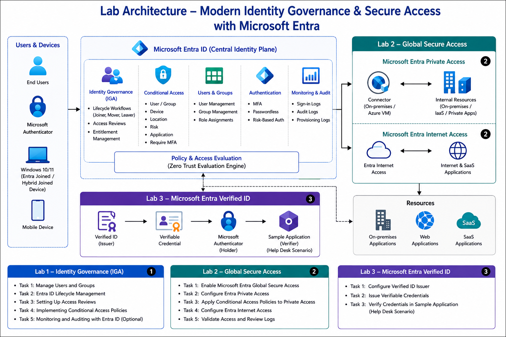
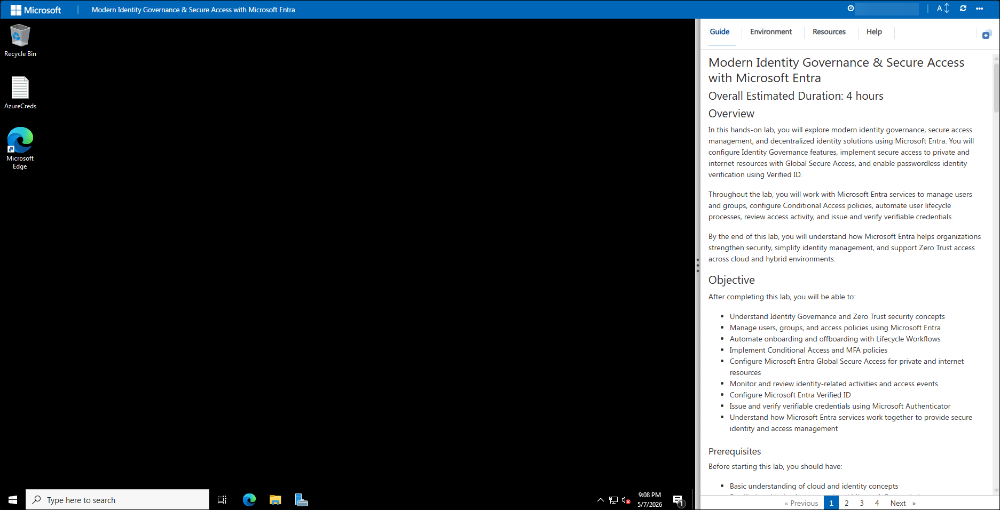
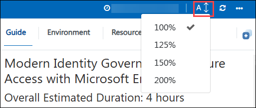
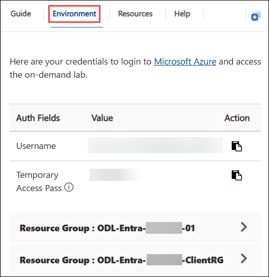
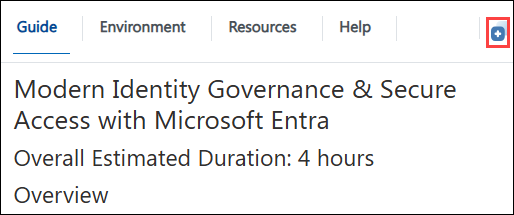
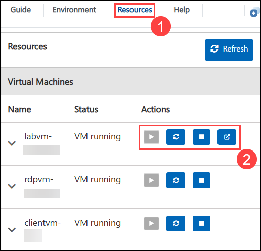
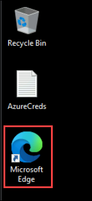
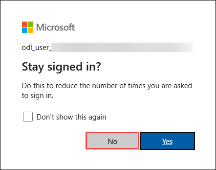

# Modern Identity Governance & Secure Access with Microsoft Entra

## Overall Estimated Duration: 4 hours

## Overview
In this hands-on lab, you will explore modern identity governance, secure access management, and decentralized identity solutions using Microsoft Entra. You will configure Identity Governance features, implement secure access to private and internet resources with Global Secure Access, and enable passwordless identity verification using Verified ID.

Throughout the lab, you will work with Microsoft Entra services to manage users and groups, configure Conditional Access policies, automate user lifecycle processes, review access activity, and issue and verify verifiable credentials.

By the end of this lab, you will understand how Microsoft Entra helps organizations strengthen security, simplify identity management, and support Zero Trust access across cloud and hybrid environments.

## Objective

After completing this lab, you will be able to:
- Understand Identity Governance and Zero Trust security concepts
- Manage users, groups, and access policies using Microsoft Entra
- Automate onboarding and offboarding with Lifecycle Workflows
- Implement Conditional Access and MFA policies
- Configure Microsoft Entra Global Secure Access for private and internet resources
- Monitor and review identity-related activities and access events
- Configure Microsoft Entra Verified ID
- Issue and verify verifiable credentials using Microsoft Authenticator
- Understand how Microsoft Entra services work together to provide secure identity and access management

### Prerequisites

Before starting this lab, you should have:
- Basic understanding of cloud and identity concepts
- Familiarity with the Azure portal and Microsoft Entra admin center
- Basic knowledge of authentication, authorization, and MFA concepts
- Understanding of users, groups, and role-based access control (RBAC)
- Basic understanding of networking concepts such as private and internet access
- General awareness of Zero Trust security principles

## Architecture

The Modern Identity Governance & Secure Access architecture uses **Microsoft Entra** to provide centralized identity management, secure access control, and decentralized identity verification across cloud and hybrid environments.

**Microsoft Entra ID** manages identities, governance policies, and access controls using features such as **Lifecycle Workflows, Access Reviews, and Conditional Access**. Microsoft Entra Global Secure Access enables secure access to private and internet resources without traditional VPN solutions. **Microsoft Entra Verified ID** provides passwordless identity verification using verifiable credentials and Microsoft Authenticator.

Built-in **Monitoring** and **Auditing** capabilities help organizations track sign-in activity, access events, and governance operations across the environment.

## Architecture Diagram

	

## Explanation of Components
The architecture for this lab involves several key components:

| Component | Description |
|---|---|
| **Microsoft Entra ID** | Central identity and access management platform. |
| **Dynamic Groups** | Automatically manage group memberships based on user attributes. |
| **Lifecycle Workflows** | Automate onboarding and offboarding processes. |
| **Access Reviews** | Periodically validate and review user access. |
| **Conditional Access** | Enforce security controls such as MFA and access policies. |
| **Global Secure Access** | Securely connect users to private and internet resources. |
| **Private Access** | Provides secure access to internal resources without VPN. |
| **Internet Access** | Applies secure web filtering and internet access controls. |
| **Global Secure Access Client** | Connects endpoint devices securely to resources. |
| **Private Access Connector** | Bridges private resources with Global Secure Access. |
| **Microsoft Entra Verified ID** | Enables decentralized identity verification using credentials. |
| **Microsoft Authenticator** | Stores and presents verifiable credentials securely. |
| **Help Desk Verification App** | Verifies user identity using Verified ID credentials. |
| **Monitoring and Auditing** | Tracks sign-ins, access events, and governance activities. |

# Getting Started with Lab

Welcome to the Modern Identity Governance & Secure Access with Microsoft Entra Workshop!. Let's begin by making the most of this experience:

## Accessing Your Lab Environment

Once you are ready to dive in, your virtual machine and guide will be right at your fingertips within your web browser.
 

## Lab Guide Zoom In/Zoom Out

To adjust the zoom level for the environment page, click the **A↕ : 100%** icon located next to the timer in the lab environment.

## Virtual Machine & Guide
 
Your virtual machine is your workhorse throughout the workshop. The guide is your roadmap to success.
 
## Exploring Your Lab Resources
 
To get a better understanding of your lab resources and credentials, navigate to the **Environment** tab.
 

 
## Utilizing the Split Window Feature
 
For convenience, you can open the guide in a separate window by selecting the **Split Window** button from the top right corner.
 

 
## Managing Your Virtual Machine
 
Feel free to **start, stop, or restart (2)** your virtual machine as needed from the **Resources (1)** tab. Your experience is in your hands!
 
	

## Let's Get Started with Azure Portal
 
1. On your virtual machine, click on the Azure Portal icon as shown below:
 
    
 
2. You'll see the **Sign into Microsoft Azure** tab. Here, enter your credentials **(1)** and click **Next (2)**.
 
   - **Email/Username:** <inject key="AzureAdUserEmail"></inject>
 
    
 
3. Next, provide your temporary password **(1)** and select **Sign in (2)**.
 
   - **Temporary Access Pass:** <inject key="AzureAdUserPassword"></inject>
 
      
 
4. If prompted to stay signed in, you can click **No**.

   
 
   
Now you're all set to explore the powerful world of technology. Feel free to reach out if you have any questions along the way. Enjoy your workshop!

## Support Contact

The CloudLabs support team is available 24/7, 365 days a year, via email and live chat to ensure seamless assistance at any time. We offer dedicated support channels tailored specifically for both learners and instructors, ensuring that all your needs are promptly and efficiently addressed.

Learner Support Contacts:

* Email Support: cloudlabs-support@spektrasystems.com 
* Live Chat Support: https://cloudlabs.ai/labs-support

Now, click on Next from the lower right corner to move on to the next page.

   

### Happy Learning!!
